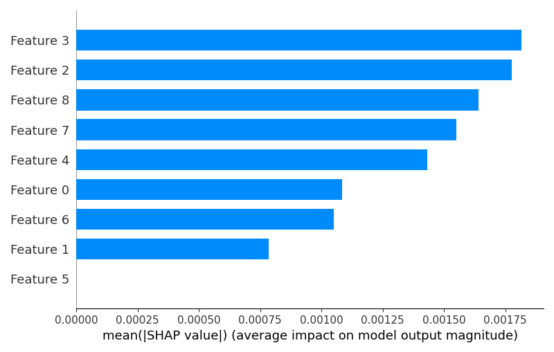

# SummerResearch2024
For the iCompBio REU program Summer of 2024 at the University of Tennessee Chattanooga.

Project Lead: Austin Nicolas.

Project Mentor: Dr. Shahnewaz Sakib.

## General Outline of Summer Research Project:
To build a framework that will take various inputs from college student users, protect their data by privatizing the dataset, and build a machine learning model trained on the privatized data that will solve a multilabel classification problem and output recommendations for topics that a student should consider for future study based on their inputs.

### Goal:
Take student input data and build a privatized version. From the privatized version a machine learning model will provide students with topics for future study. Then the students take these topics to advisors, professors, counselors, peers, and others. These people will help the student pick what courses to take the upcoming semester based on the topics given and the courses offered at the student’s school.

## Main Functions:

### [main](main.py):
The main file of the framework. Generates a synthetic dataset using 'data_generation', privatizes the dataset using 'privatization', calculates the privacy metrics using 'privacy_metrics', and trains a neural network on the data using 'neural_network'.

### [config](config.py):
Contains the basic configurations for the model. Most important is the ability to configure which parts of the model you want to run. The list you can pick from is: Generate Dataset, Privatize Dataset, Calculate Privacy Metrics, Run Neural Network, and Test Neural Network.

## Data Generation:

### [datafiles_for_data_construction](datafiles_for_data_construction)
Various JSON files that have lists of data and feature tuples. This folder also contains the data.py file.

### [data](datafiles_for_data_construction/data.py):
Dictionary that containts demographic information, lists of features, feature tuples, and mappings between various features of the dataset.

### [data_generation_CPU](data_generation/data_generation_CPU.py):
Generates the synthetic dataset on the computer's CPU. The dataset contains the following elements: first name, last name, race or ethnicity, gender, international student status, socioeconomic status, learning style(s), gpa, student semester, major(s), previous courses, previous course types, course subjects, subjects of interest, career aspirations, extracurricular activities, and future topics.

```python
from data import Data
from config import load_config
from data_generation_CPU import DataGenerator

# Create generator class
generator = DataGenerator(config, data)

# Set generation levels
num_samples = 1000
batch_size = 100

# Returns a synthetic dataset with num_samples many rows ('students')
generator.generate_synthetic_dataset(num_samples, batch_size)
```

### [data_generation_GPU](data_generation/data_generation_GPU.py):
Generates the synthetic dataset on the computer's GPU. The dataset contains the following elements: first name, last name, race or ethnicity, gender, international student status, socioeconomic status, learning style(s), gpa, student semester, major(s), previous courses, previous course types, course subjects, subjects of interest, career aspirations, extracurricular activities, and future topics.

```python
from data import Data
from config import load_config
from data_generation_GPU import DataGenerator

# Create generator class
generator = DataGenerator(config, data)

# Set generation levels
num_samples = 1000
batch_size = 100

# Returns a synthetic dataset with num_samples many rows ('students')
generator.generate_synthetic_dataset(num_samples, batch_size)
```

### [data_analysis](data_generation/data_analysis.py):
Takes the synthetic dataset and produces various graphs about the data. For the numerical columns boxplots, distributions, and summary statistics are produced. For all the other columns the top ten highest count items are displayed. Calculates the percentage of empty of NaN values in each column.

```python
from pandas import pd
from config import load_config

# Import synthetic dataset CSV as a pandas dataframe
synthetic_dataset = pd.readcsv('path_to_synthetic_dataset.csv')

# Load configuration
config = load_config()

# Create generator class
analyzer = DataAnalysis(config, synthetic_dataset)
analyzer.analyze_data()

# Saves data analysis graphs to the data_analysis_graphs folder
analyzer.analyze_data()
```

### [data_analysis_graphs](data_generation/data_analysis_graphs):
This folder contains all the graphs produced by data_analysis.

### [Dataset](data_generation/Dataset.csv)
Synthetic dataset. The file here contains 25,000 'students', but you can generate as much data as you need using the data generation functions.

<p align="center">
  
</p>

## Data Preprocessing:

### Splitting the Data:
Xp = [first name, last name, race or ethnicity, gender, international student status, socioeconomic status]

Xp columns are cut out and removed as we want to keep these hidden and they would be useless for determining a student's career aspirations or future topics.

X = [learning style(s), gpa, student semester, major(s), previous courses, previous course types, course subjects, subjects of interest, extracurricular activities]

X columns are privatized using various techniques. These will also be the features for the neural network.

Xu = [career aspirations, future topics]

Xu columns are left alone. These utility columns are the targets for the neural network.

### [preprocessing](data_preprocessing/preprocessing.py):
preprocess_dataset() - Takes in a synthetic dataset. Xp is cut out, X and Xu are converted from lists of strings to lists of numbers. Outputs a preprocessed dataset.

run_RNN_models() - Takes in a preprocessed dataset. For each list in each column, the lists are padded so they become the same length. Then an RNN is run to reduce dimensionality such that each column becomes 1 dimensional.

```python
from pandas import pd
from config import load_config
from data import Data
from preprocessing import PreProcessing

# Import synthetic dataset CSV as a pandas dataframe
synthetic_dataset = pd.readcsv('path_to_synthetic_dataset.csv')

# Load configuration and data
config = load_config()
data = Data()

# Create preprocessor class
preprocesser = PreProcessing(config, data)

# Returns preprocessed dataset
preprocesser.preprocess_dataset(synthetic_dataset)

# Create the RNN models and save them to their files
# Use one of these models to reduce the dimensionality
# of the preprocessed dataset
preprocessor.create_RNN_models(synthetic_dataset)
```

### [Preprocessed_Dataset](data_preprocessing/Preprocessed_Dataset.csv):
All feature columns and utility columns are 1 dimensional.

### [feature_importance](data_preprocessing/feature_importance.py):
Run a random forest model and analyze feature importance using SHAP. Calculate this feature importance among feature columns (X) for calculating both utility (Xu) columns: 'career aspirations' and 'future topics'.

```python
from pandas import pd
from config import load_config
from feature_importance import FeatureImportanceAnalyzer

# Import preprocessed dataset (with RNN dimensionality reduction) CSV as a pandas dataframe
preprocessed_dataset = pd.readcsv('RNN_model.csv')

# Load configuration and data
config = load_config()

# Create preprocessor class
feature_analyzer = FeatureImportanceAnalyzer(config, preprocessed_dataset)

# Returns preprocessed dataset
feature_analyzer.calculate_feature_importance()
```

### :
SHAP values for X columns based on predictive power for career aspirations.

### :
SHAP values for X columns based on predictive power for future topics.

### [explained_variance_plot - Under Construction](data_preprocessing/explained_variance_plot.png):
Graph of the explained variance ratio of each principal component.

## Data Privatization

### [privatization - Under Construction](data_privatization/privatization.py):
Generates the privatized dataset based on the preprocessed dataset using various methods including: basic differential privacy (using laplace noise addition), uniform noise addition, randomized response, and random shuffling.

```python
from pandas import pd
from config import load_config
from privatization import Privatizer

# Import preprocessed dataset CSV as a pandas dataframe
preprocessed_dataset = pd.readcsv('path_to_preprocessed_dataset.csv')

# Create privatizer class
privatizer = Privatizer(config)

# Returns privatized dataset
privatizer.privatize_dataset(preprocessed_dataset, utility_cols)
```

### [Privatized_Dataset - Under Construction](data_privatization/Privatized_Dataset.csv)
Xp is cut out, X and Xu are multilabel binarized. PCA is run on X.

### [privacy_metrics - Under Construction](data_privatization/privacy_metrics.py):
Calculates the level of data privatization using various metrics: Mean comparison, STD comparison, and Sum comparison. Also outputs the privatization method used and the parameters of the method.

```python
from pandas import pd
from config import load_config
from privacy_metrics import PrivacyMetrics

# Import preprocessed and privatized dataset CSVs as pandas dataframes
preprocessed_dataset = pd.readcsv('path_to_preprocessed_dataset.csv')
privatized_dataset = pd.readcsv('path_to_privatized_dataset.csv')

# Create privacy metrics class
metrics = PrivacyMetrics(config)

# Returns the privacy method and its parameters
# Saves the statistical comparison to 'Stats_Comparison_Dataset.csv'
metrics.calculate_privacy_metrics(preprocessed_dataset, privatized_dataset)
```

### [Stats_Comparison_Dataset - Under Construction](data_privatization/Stats_Comparison_Dataset.csv)
Each row is a column from 'Privatized_Dataset' with the utility columns removed. The columns are the dataset column names, original mean, anonymized mean, original standard deviation, anonymized standard deviation, original sum, anonymized sum.

## Neural Network​:

### [neural_network - Under Construction](neural_network/neural_network.py):
Creates and runs a neural network on the privatized dataset. The target is 'future topics' and the features are the PCA columns. The NeuralNetwork class can also run a cross validation of the model, extract the feature importance for the model, and tune the model hyperparameters.

### [Feature_Importance - Under Construction](neural_network/Feature_Importance.csv)
Columns are features, mean feature importance, and standard deviation feature importance.

## Sources and Acknowlegments:
https://discovery.cs.illinois.edu/dataset/course-catalog/ - Course Catalog with Course Names, Course Types, and Course Subject Abbreviations.

https://educationdata.org/college-enrollment-statistics - College Demographic Statistics

https://files.eric.ed.gov/fulltext/EJ1192524.pdf - Learning Style Statistics

https://data.world/len/us-first-names-database - First and Last Names Database

https://www.pewresearch.org/social-trends/2019/05/22/a-rising-share-of-undergraduates-are-from-poor-families-especially-at-less-selective-colleges/ - College Family Income Statistics

https://williamsinstitute.law.ucla.edu/publications/nonbinary-lgbtq-adults-us/ - Nonbinary Statistics

https://nces.ed.gov - Gender College Statistics

https://courses.illinois.edu/schedule/DEFAULT/DEFAULT - Course Subject Abbreviation to Course Subject Mapping

https://bigeconomics.org/college-majors-explorer/ - List of Majors, Careers

Python GPT and Chat GPT4o assisted in the programming process
